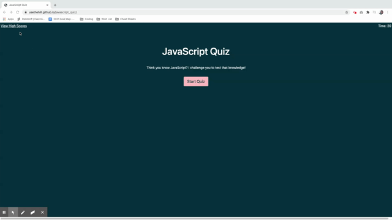

# javascript_quiz

## Description:

When you open the page you will see the quiz name and a button to start the quiz.  Once you click the button you will be presented with a question and options to answer and the 20 second timer will start.  Once you answer a question you will be presented with another question.  When you answer a question incorrectly you will be deducted 3 seconds from your timer.  When all the questions are answered or the timer reaches 0 then the game is over.  When the game is over then the user can save their initials and submit it to the high scores page.

---

## Deployed page: !https://usethehill.github.io/javascript_quiz/

---

## Demo of quiz:
